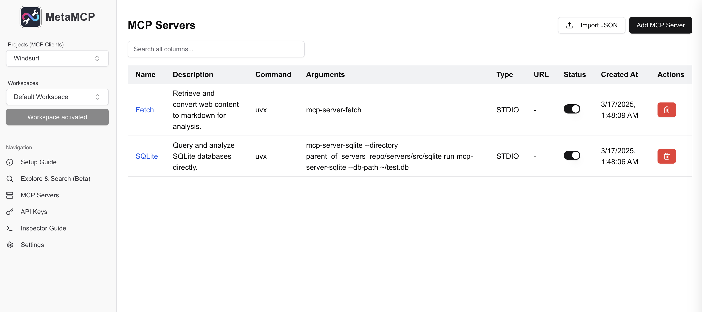
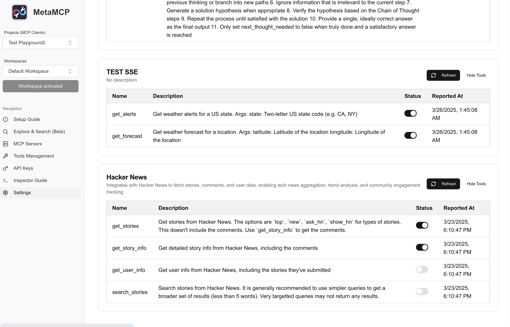

# MetaMCP (Unified middleware MCP to manage all your MCPs)

[](https://discord.gg/mNsyat7mFX)

https://metamcp.com (Cloud version online now and available for free)

MetaMCP is "the One" middleware MCP to manage all your MCPs. It uses a GUI fullstack app (this repo) and a local MCP proxy to achieve this. (see our latest npm repo [mcp-server-metamcp](https://github.com/metatool-ai/mcp-server-metamcp))

A few feature highlights:

- GUI app to manage multiple MCP server integrations all together.
- Support ANY MCP clients (e.g., Claude Desktop, Cursor, etc.) because MetaMCP is a MCP server.
- Support prompts, resources, tools under MCP.
- Support multi-workspace: e.g., activate a workspace of DB1 or switch to DB2 in another workspace, preventing polluting context of DB1 to your MCP Client.
- Tool level toggle on/off

The app is also self hostable, free and open source. There is also a cloud version. You can try how this app works using cloud version but I actually encourage you to self host if you are familiar with docker: it will provide unlimited access with lower latency, full private operations on your end.

Check out demo videos at https://metamcp.com/. Here is an overview screenshot.




## Verified Platform

- [x] Windows (after MCP official typescript SDK 1.8.0, which we updated accordingly, it works) https://github.com/metatool-ai/metatool-app/issues/15
- [x] Mac
- [x] Linux

## Installation

To get instantly started with cloud version visit https://metamcp.com/.
To get started with this self hostable version of MetaMCP App, the eastiest way is to clone the repository and use Docker Compose to run it.

```bash
git clone https://github.com/metatool-ai/metatool-app.git
cd metatool-app
cp example.env .env
docker compose up --build -d
```

Then open http://localhost:12005 in your browser to open MetaMCP App.

It is recommended to have npx (node.js based mcp) and uvx (python based mcp) installed globally.
To install uv check: https://docs.astral.sh/uv/getting-started/installation/

You also need a MCP Client to connect to `@metamcp/mcp-server-metamcp`. For example if you are using [Claude Desktop](https://modelcontextprotocol.io/quickstart/user), the config json may look like this:

```json
{
  "mcpServers": {
    "MetaMCP": {
      "command": "npx",
      "args": ["-y", "@metamcp/mcp-server-metamcp@latest"],
      "env": {
        "METAMCP_API_KEY": "<your api key>",
        "METAMCP_API_BASE_URL": "http://localhost:12005"
      }
    }
  }
}
```

For Cursor, env vars aren't easy to get typed in so you may use args instead

```bash
npx -y @metamcp/mcp-server-metamcp@latest --metamcp-api-key <your-api-key> --metamcp-api-base-url <base-url>
```

You can get the API key from the MetaMCP App's API Keys page (self hosted available).

## Architecture Overview

Note that prompts and resources are also covered similar to tools.

```mermaid
sequenceDiagram
    participant MCPClient as MCP Client (e.g., Claude Desktop)
    participant MetaMCPMCP as MetaMCP MCP Server
    participant MetaMCPApp as MetaMCP App
    participant MCPServers as Installed MCP Servers in MetaMCP App

    MCPClient ->> MetaMCPMCP: Request list tools
    MetaMCPMCP ->> MetaMCPApp: Get tools configuration & status
    MetaMCPApp ->> MetaMCPMCP: Return tools configuration & status

    loop For each listed MCP Server
        MetaMCPMCP ->> MCPServers: Request list_tools
        MCPServers ->> MetaMCPMCP: Return list of tools
    end

    MetaMCPMCP ->> MetaMCPMCP: Aggregate tool lists
    MetaMCPMCP ->> MCPClient: Return aggregated list of tools

    MCPClient ->> MetaMCPMCP: Call tool
    MetaMCPMCP ->> MCPServers: call_tool to target MCP Server
    MCPServers ->> MetaMCPMCP: Return tool response
    MetaMCPMCP ->> MCPClient: Return tool response
```

## License

GNU AGPL v3

## Credits
- Used some oauth codes in https://github.com/modelcontextprotocol/inspector
- (Deprecated) Demo video uses MCP Client [5ire](https://5ire.app/)
